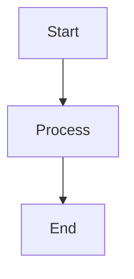

Put your plan, story, and any supporting material here, you could use the help of a readme markdown generator such as [readme.so](https://readme.so/)

## Around the world in 80 Margaritas

## Overview

The aim of this project was to create a fun and engaging Javascript challenge that would test its user's ability to interact with object arguments and use the delivered information to return a

A brief description of the project, its goals, and intended outcomes.

## Planning Phase

### Project Requirements

- Primary objectives and must-have features
- Secondary objectives and nice-to-have features
- Technical constraints and limitations

### Timeline

- Phase 1: Initial Research (Weeks 1-2)
- Phase 2: Development (Weeks 3-6)
- Phase 3: Testing (Weeks 7-8)
- Phase 4: Launch (Week 9)

### Resources

- Team members and roles
- Budget allocation
- Required tools and technologies

## Brainstorming

### Ideas & Concepts

1. First major concept

   - Supporting details
   - Potential challenges
   - Implementation approaches

2. Second major concept
   - Supporting details
   - Potential challenges
   - Implementation approaches

### Research Notes

- Market analysis findings
- Competitor research
- Technical feasibility studies

## Implementation

### Progress Tracking

- [ ] Task 1
  - [ ] Subtask A
  - [ ] Subtask B
- [ ] Task 2
  - [ ] Subtask A
  - [ ] Subtask B

### Technical Documentation

```python
# Example code block
def example_function():
    pass
```

### Challenges & Solutions

| Challenge | Solution          | Status   |
| --------- | ----------------- | -------- |
| Issue 1   | Approach taken    | Resolved |
| Issue 2   | Proposed solution | Pending  |

## Results & Analysis

### Metrics

- Performance measurements
- Success criteria results
- Areas for improvement

### Visualizations



## User Feedback

### Testing Results

#### Alpha Testing

- Internal feedback
- Bug reports
- Feature requests

#### Beta Testing

- User experience reports
- Performance feedback
- Feature adoption rates

### User Testimonials

> "User quote providing specific feedback about the project"

### Improvement Suggestions

1. High priority improvements
2. Medium priority improvements
3. Future considerations

## Next Steps

- Action items
- Future development plans
- Maintenance schedule

---

## Appendix

### Reference Links

- [Documentation](https://example.com)
- [Resources](https://example.com)

### Change Log

- v1.0.0 - Initial release
- v1.1.0 - Feature updates
