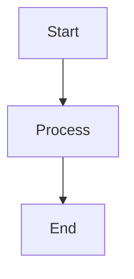

Put your plan, story, and any supporting material here, you could use the help of a readme markdown generator such as [readme.so](https://readme.so/)

# Around the world in 80 Margaritas

## Project Summary

The aim of this project was to create a fun and engaging Javascript challenge that would test its user's ability to interact with object arguments and use the provided information to return an array of valid matches.

## Project Description

For this project, you are aiming to create a function that filters a list of countries based on the characteristics of their flags. The function, filterFlag, takes two arguments: an object containing the search terms (characteristics of the flag) and an array of flag data (full_flag_list). The function returns an array of country names that match the given characteristics.

### Flag Data Structure

Each country's flag is represented by an object with the following keys:

- `country`: string
- `hasStripes`: boolean
- `numberOfColors`: int
- `hasStars`: boolean
- `stripeDirection`: string (can be "horizontal", "vertical" or null)
- `hasCircles`: boolean
- `colours`: [string, string, string] (an array containing varying number of strings)

### Function Requirements

The `filterFlag` function should:

1. Handle input objects with varying sets of characteristics.
2. Return the names of the countries that match the given characteristics.

### Requirements

Environment Dependencies:

- Run [npm install] in your terminal to install the required dependencies for this project
- Trigger the test suite through typing the command [npm run test] in your terminal

Input Constraints:

- Number of keys in search_terms will be <= 6
- Input will never be null
- All input keys will have a corresponding value in the object full_flag_list

Output Format:

- Output should be returned as a array of strings, e.g. ['Belgium', 'Germany', 'Venezuela', 'Romania']

### Example Usage

- `filterFlag({hasStripes: true, hasCircles: true}, full_flag_list)` should return `['Argentina']` as this is the only flag with both stripes and a circle.
- `filterFlag({colours: ['red', 'yellow'], numberOfColors: 3}, full_flag_list)` should return `['Belgium', 'Germany', 'Venezuela', 'Romania']`.
- `filterFlag({hasStripes: false, numberOfColors: 2, stripeDirection: null}, full_flag_list)` should return `['China', 'European Union', 'Japan', 'Switzerland']`.

### Evaluation Criteria

- Correctness: Your code must pass all test cases
- Input will never be null
- All input keys will have a corresponding value in the object full_flag_list

## Planning Phase

### Project Requirements

- Design a full suite of tests to evaluate proposed solution against various input objects
-
- Technical constraints and limitations

### Timeline

- Phase 1: Initial Research (Weeks 1-2)
- Phase 2: Development (Weeks 3-6)
- Phase 3: Testing (Weeks 7-8)
- Phase 4: Launch (Week 9)

### Resources

- Team members and roles
- Budget allocation
- Required tools and technologies

## Brainstorming

### Ideas & Concepts

1. First major concept

   - Supporting details
   - Potential challenges
   - Implementation approaches

2. Second major concept
   - Supporting details
   - Potential challenges
   - Implementation approaches

### Research Notes

- Market analysis findings
- Competitor research
- Technical feasibility studies

## Implementation

### Progress Tracking

- [ ] Task 1
  - [ ] Subtask A
  - [ ] Subtask B
- [ ] Task 2
  - [ ] Subtask A
  - [ ] Subtask B

### Technical Documentation

```python
# Example code block
def example_function():
    pass
```

### Challenges & Solutions

| Challenge | Solution          | Status   |
| --------- | ----------------- | -------- |
| Issue 1   | Approach taken    | Resolved |
| Issue 2   | Proposed solution | Pending  |

## Results & Analysis

### Metrics

- Performance measurements
- Success criteria results
- Areas for improvement

### Visualizations



## User Feedback

### Testing Results

#### Alpha Testing

- Internal feedback
- Bug reports
- Feature requests

#### Beta Testing

- User experience reports
- Performance feedback
- Feature adoption rates

### User Testimonials

> "User quote providing specific feedback about the project"

### Improvement Suggestions

1. High priority improvements
2. Medium priority improvements
3. Future considerations

## Next Steps

- Action items
- Future development plans
- Maintenance schedule

---

## Appendix

### Reference Links

- [Documentation](https://example.com)
- [Resources](https://example.com)

### Change Log

- v1.0.0 - Initial release
- v1.1.0 - Feature updates
